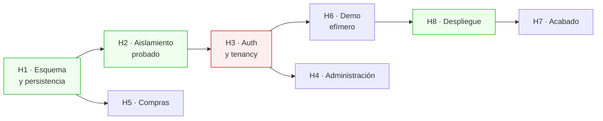

# Plan hasta el sistema terminado

Este documento dice, sin adornos, qué falta para que CoreBiz esté **desplegado, con datos reales
y con el aislamiento multi-tenant demostrado**, que es el único estado en el que el proyecto
cumple lo que promete.

El criterio de "terminado" es concreto y verificable:

> Un reclutador abre `corebiz.vercel.app/demo` desde el móvil, recibe su propio entorno con
> datos sembrados, opera el ciclo completo de venta, choca contra el límite del plan gratuito,
> y nada de lo que haga alcanza los datos de otro visitante. El repo, mientras tanto, tiene la
> matriz de aislamiento RLS en verde dentro de CI.

---

## Dónde está el proyecto hoy

Lo verificado, no lo aspiracional.

| Capa                          | Estado                                                                |
| ----------------------------- | --------------------------------------------------------------------- |
| Dominio (`packages/domain`)   | ✅ Ventas, inventario, RBAC, planes, dinero dual. 220 tests unitarios |
| Casos de uso                  | ✅ 5, con puertos definidos y auditoría                               |
| Adaptadores en memoria        | ✅ Con rollback real. Sostienen `pnpm dev:nodb` y toda la suite       |
| Interfaz (`apps/web`)         | ✅ 9 páginas, Server Actions, i18n ES/EN, gating PRO                  |
| Tests E2E + BDD               | ✅ 14 escenarios Gherkin, 23 tests, independientes del orden          |
| Arquitectura verificada en CI | ✅ `dependency-cruiser` rompe el build si el dominio se acopla        |
| Persistencia real             | ✅ Adaptadores Drizzle de cada puerto, UoW sobre transacción real     |
| Tablas de negocio             | ✅ 11 tablas, migraciones aplicadas y semilla que cuadra sola         |
| Aislamiento probado           | ✅ Matriz sobre toda tabla con `tenant_id`. 27 tests de integración   |
| **Autenticación**             | ❌ El rol y el plan salen de dos cookies de demo                      |
| Compras y proveedores         | ❌ El directorio del dominio está vacío                               |
| Administración                | ❌ Sin invitaciones, sin gestión de roles, sin visor de auditoría     |
| Demo efímero                  | ❌ Sin función de clonado, sin TTL, sin purga                         |
| Despliegue                    | ❌ Nunca ha corrido fuera de esta máquina                             |

**La lectura honesta:** el sistema ya corre sobre Postgres con las políticas RLS ejecutándose
en CI, y los 14 escenarios BDD pasan contra los dos adaptadores sin cambiar una línea. Lo que
queda por delante es lo que separa un repositorio de un producto: una sesión de verdad, un
demo que se pueda visitar y un despliegue que sobreviva a la pausa de Supabase.

---

## El camino crítico

Las fases están ordenadas por **dependencia dura**, no por preferencia. Cada una desbloquea la
siguiente, y las tres primeras son innegociables antes de desplegar.

H4, H5 y H7 son paralelizables. **H1 → H2 → H3 → H6 → H8 es la línea recta hacia el link del CV**,
y ninguna se puede saltar.

---

## H1 · Esquema y persistencia real — ✅ HECHA

**Por qué bloqueaba todo:** no existía ni una sola tabla de negocio, y el composition root
lanzaba una excepción explícita para el driver `postgres` —fallar claro en vez de arrancar a
medias— así que no había nada que desplegar.

Fue la fase más grande y la de menor riesgo de diseño: los puertos ya existían y los adaptadores
en memoria eran la especificación ejecutable de lo que había que reproducir contra Postgres.

**Lo que costó más de lo previsto:** la semilla. `config.toml` apuntaba a un `seed.sql` que no
existía, y escribirlo obligó a decidir algo que el plan daba por hecho — que los datos de Postgres
fuesen **exactamente** los del driver en memoria. Sin esa igualdad, los escenarios Gherkin
necesitan una variante por adaptador y el criterio de abajo deja de poder cumplirse.

**Qué construir**

- [x] Esquema Drizzle de los módulos de negocio en `packages/db/src/schema/`: `customers`,
      `products`, `product_stock`, `stock_movements`, `delivery_notes`, `delivery_note_lines`,
      `payments`. Los nombres ya están comprometidos en la lista de la migración de políticas.
- [x] Migraciones `create table` correspondientes. **Sin ellas, la migración de RLS salta las tablas
      en silencio** (`if to_regclass(...) is null then continue`) y el sistema queda sin políticas
      pareciendo que las tiene. Este es el fallo más peligroso del estado actual.
- [x] Convenciones ya decididas y que hay que respetar fila a fila: `bigint` en unidades mínimas para
      dinero, `uuid v7` como PK, índice compuesto con `tenant_id` **siempre primero**, tasa de cambio
      congelada en cada documento.
- [x] `packages/infrastructure/` con los adaptadores Drizzle de cada puerto. Un archivo por
      repositorio, espejo de los de memoria.
- [x] `UnitOfWork` real sobre una transacción de `postgres.js`, con `set_config(..., true)` para las
      GUCs de tenant. **Local a la transacción, nunca a la sesión** — con `false`, Supavisor reutiliza
      la conexión para otro tenant y la fuga es directa.
- [x] `DocumentSequences` con `select ... for update`: el correlativo de las notas de entrega no
      admite huecos ni duplicados bajo concurrencia.
- [x] Conectar el driver `postgres` en el composition root, sustituyendo el `throw`.
- [x] Cliente `postgres.js` con `prepare: false` y `max: 1` como singleton de módulo. Sin esto
      funciona en local y revienta en producción, que es la peor forma de descubrirlo.

**Hecho cuando:** `DATA_DRIVER=postgres pnpm dev` levanta la aplicación contra Supabase local y los
14 escenarios BDD pasan **sin tocarse una línea**. Ese es el punto: si los tests no distinguen el
adaptador, la arquitectura hexagonal era real.

---

## H2 · El aislamiento, probado — ✅ HECHA

**Por qué bloqueaba el despliegue:** las políticas RLS estaban escritas y eran buenas, pero
nunca se habían ejecutado. Una política no probada es una hipótesis, y publicar un SaaS
multi-tenant sobre una hipótesis es exactamente lo que este proyecto dice saber evitar.

La matriz se comprobó por mutación, no solo por estar en verde: quitar `force row level security`
de una tabla y aflojar una política a `using (true)` ponen la suite en rojo. Un test de
aislamiento que nunca ha fallado no ha demostrado nada.

**Qué construir**

- [x] Matriz de aislamiento parametrizada: recorre la lista de tablas con `tenant_id` y, para cada
      una, autentica como tenant A e intenta `select` / `update` / `delete` sobre filas del tenant B,
      exigiendo cero filas afectadas. **Al añadirse una tabla nueva sin política, el test falla solo.**
- [x] Test de la fuga por GUC pegada: dos transacciones seguidas sobre la **misma conexión** con
      tenants distintos, comprobando que la segunda no ve nada de la primera. Es la prueba directa de
      por qué `set_config` va con `true`.
- [x] Test del `with check` en `update`: intentar mover una fila propia al tenant ajeno cambiándole
      el `tenant_id` debe fallar.
- [x] Test de `force row level security`, con un matiz que conviene decir: la comprobación es
      **estructural** (`relforcerowsecurity` en toda tabla con `tenant_id`) y no conductual. En
      Supabase el propietario de las tablas es `postgres`, que además tiene `BYPASSRLS`, así que
      desde su sesión no hay forma de observar el efecto de FORCE. A cambio hay un test que sí es
      conductual y cubre el riesgo real: dentro del Unit of Work, `current_user` es `authenticated`
      y ese rol no tiene ni `rolsuper` ni `rolbypassrls`.
- [x] Test de inmutabilidad del `audit_log`: `insert` y `select` permitidos, `update` y `delete`
      denegados.
- [x] Job `integration` en CI con `supabase start` sobre `ubuntu-latest`.

**Hecho:** el job `integration` levanta Supabase en CI, corre la matriz y después ejecuta los
mismos 14 escenarios BDD contra Postgres. `pnpm test:integration` ya no lleva _(pendiente)_
en la tabla del README. Esta es la fase que responde la pregunta de entrevista _"¿cómo sabes que tu
multi-tenant no filtra datos?"_ con un comando en vez de con una explicación.

---

## H3 · Autenticación y tenancy de verdad

**Por qué bloquea:** hoy `resolveContext()` lee el rol y el plan de dos cookies que cualquiera puede
editar desde las herramientas del navegador. Es deliberado y está comentado —permite a quien visita
la demo ver el RBAC actuando en vivo— pero no es autenticación.

**Qué construir**

- [ ] Supabase Auth con `@supabase/ssr`, sesión en cookies `httpOnly` `Secure` `SameSite=Lax`.
- [ ] Rutas `(auth)`: registro, acceso, recuperación, aceptar invitación.
- [ ] Alta de tenant en el registro: crear tenant, membresía `owner` y ajustes por defecto, en una
      transacción.
- [ ] `resolveContext()` pasa a validar la sesión y cargar la membresía desde la base de datos.
      **Las cookies de demo sobreviven solo dentro de un tenant marcado `is_demo`**, donde no hay nada
      que proteger y sí mucho que enseñar.
- [ ] Middleware que resuelve el tenant activo y rechaza el acceso cruzado por URL.
- [ ] Cabeceras de seguridad: CSP con nonce por request, HSTS, `Referrer-Policy`,
      `Permissions-Policy`, `X-Content-Type-Options`, `X-Frame-Options`.
- [ ] Rate limiting con `security.rate_limit_hit()` en Postgres —un solo UPSERT atómico, $0, sin
      servicio externo— detrás del puerto `RateLimiter`.

**Hecho cuando:** dos cuentas reales en dos navegadores no ven nada la una de la otra, ni siquiera
forzando identificadores en la URL. Comprobación manual además del test automático: aquí conviene
mirarlo con los propios ojos.

---

## H4 · Módulo de administración

Cierra el bucle de la multi-tenancy: sin esto un tenant no puede crecer más allá de su fundador.

- [ ] Invitaciones por correo con token de un solo uso y caducidad.
- [ ] Gestión de roles, respetando el trigger `enforce_last_owner` que ya impide quedarse sin dueño.
- [ ] Visor del `audit_log` con filtros por actor, acción y fecha; exportación **gated a PRO**.
- [ ] Ajustes del tenant: etiqueta y tasa del impuesto informativo, moneda base, tasa de cambio.
- [ ] Panel de consumo del plan, con los mismos contadores que ya bloquean en el caso de uso.

**Hecho cuando:** el límite de 2 usuarios del plan FREE se puede alcanzar por la interfaz y el bloqueo
viene del caso de uso, no del botón. Se prueba invocando la Server Action directamente.

---

## H5 · Compras y proveedores

El único módulo del alcance acordado que no se ha empezado. Cierra el ciclo **comprar → stock → vender**.

- [ ] Agregados `Supplier`, `PurchaseOrder`, `GoodsReceipt` en `packages/domain/src/purchasing/`.
- [ ] La recepción de mercancía **suma stock generando movimientos**, igual que la emisión resta.
      Reutiliza el libro mayor que ya existe, sin tocar el saldo directamente.
- [ ] Casos de uso, adaptadores, esquema, interfaz y escenarios BDD, siguiendo el patrón ya establecido.
- [ ] Módulo completo **gated a PRO**, como se decidió en la tabla de planes.

**Nota de alcance:** `Supplier` es un CRUD casi plano y está bien que lo sea. El músculo hexagonal se
demuestra en `GoodsReceipt`, donde hay invariante real. Aplicar la misma ceremonia a todo sería peor
ingeniería, y explicar por qué vale más que hacerlo.

---

## H6 · Demo efímero y control de coste

Es la fase que convierte el proyecto en un link del CV en vez de un repo más.

- [ ] Función SQL `clone_demo_tenant()`: `insert ... select` desde el tenant plantilla, remapeando
      las claves con `uuid_generate_v5(nuevo_tenant, id_viejo::text)`. Determinista, sin tabla de
      mapeo, sin orden de dependencias, una transacción.
- [ ] Ruta `/demo`: cookie firmada que **reutiliza** el sandbox existente en vez de crear otro.
- [ ] Semilla compacta (~600–900 filas, ≈1,5 MB) que aparente un negocio con historia.
- [ ] Purga con `pg_cron` cada 10 minutos, TTL de 24 h. Va dentro de Postgres porque el cron de
      Vercel Hobby es diario. Respaldos: purga perezosa dentro de la propia provisión, y el cron
      diario de Vercel como tercera red.
- [ ] Circuit breaker sobre `pg_database_size()`: por encima del **70 %** de los 500 MB se deja de
      crear sandboxes y se sirve un demo compartido de solo lectura; por encima del **85 %**, purga
      agresiva sin esperar al TTL.
- [ ] Anti-abuso: 1 sandbox por IP y hora, tope global de 50 concurrentes (≈20 MB, 6 % del presupuesto).

**Por qué el modo degradado importa más que el límite:** un reclutador tiene que ver algo funcionando
siempre. Un error de cuota en el link del CV es el peor resultado posible del proyecto entero.

**Hecho cuando:** `/demo` en incógnito entrega un tenant sembrado propio, y forzar el umbral del
circuit breaker cae a modo degradado en lugar de fallar.

---

## H7 · Acabado

- [ ] PDF de la nota de entrega, con el aviso **"Documento no fiscal / sin valor fiscal"** en el pie.
      El guardián `check-non-fiscal.sh` ya vigila el vocabulario; esto es su contraparte visible.
- [ ] Landing pública que explique qué es CoreBiz y lleve al demo en un clic.
- [ ] Observabilidad mínima: `/api/health`, registro estructurado de errores.
- [ ] Tests de accesibilidad con `@axe-core/playwright` sobre las rutas principales.
- [ ] Diagrama de dependencias regenerado (`pnpm arch:graph`) y ADRs de las decisiones de H1–H6.

---

## H8 · Despliegue

El recorrido está escrito en [`DEPLOY.md`](DEPLOY.md). Lo que hay que recordar:

- [ ] Repositorio público en GitHub.
- [ ] Proyecto Supabase; migraciones por **conexión directa (5432)**, aplicación por **pooler (6543)**.
- [ ] Extensiones `pg_cron` y `uuid-ossp`.
- [ ] Vercel: variables de entorno, con `SUPABASE_SERVICE_ROLE_KEY` y `CRON_SECRET` marcadas como
      sensibles y comparadas en tiempo constante.
- [ ] **Keepalive funcionando y comprobado.** Supabase pausa el proyecto tras 7 días sin tráfico y el
      link del CV muere solo. GitHub Actions cada 2 días, **más un monitor externo**
      (cron-job.org o UptimeRobot) porque GitHub desactiva los workflows programados tras 60 días sin
      commits. Esto es lo primero que hay que verificar después del despliegue, no lo último.

---

## Fuera de alcance, a propósito

Decidido, no olvidado:

- **Pasarela de pago.** El sistema de cuotas y gating se implementa completo porque es lo que se
  evalúa; el cobro real se activa desde administración. Vercel Hobby prohíbe el uso comercial, así
  que integrar Stripe rozaría esa cláusula sin añadir nada al portafolio.
- **Presupuestos (`quotes`).** Las tablas están en la lista de RLS y el flujo está diseñado, pero la
  nota de entrega ya demuestra la máquina de estados. Entra después de H6 si sobra tiempo.
- **Backups.** Supabase Free no los ofrece. El entorno demo es reconstruible desde la semilla del
  repo por diseño, así que la ausencia de backup es una consecuencia aceptada, no un descuido.

---

## Riesgos abiertos

| Riesgo                                                         | Mitigación                                                            |
| -------------------------------------------------------------- | --------------------------------------------------------------------- |
| Las políticas RLS fallan al ejecutarse por primera vez         | H2 va inmediatamente después de H1, antes de construir nada encima    |
| El pooler en modo transacción rompe algo que funciona en local | `prepare: false` desde el primer commit del adaptador, no como parche |
| Los 500 MB se llenan con sandboxes                             | Semilla compacta, tope de 50, TTL de 24 h y modo degradado            |
| El proyecto se pausa y el link del CV muere                    | Keepalive **con respaldo externo**; se verifica el día del despliegue |
| Los tests de integración alargan CI                            | Job en paralelo, caché de pnpm y de navegadores                       |

---

## Orden recomendado

**H1 → H2 → H3 → H6 → H8**, y después H4, H5 y H7 sobre un sistema ya vivo.

La tentación es construir Compras primero porque es el módulo que más se parece a lo ya hecho y sale
rápido. Sería un error: añadiría superficie sobre un almacén en memoria y alejaría el despliegue.
**El proyecto vale más desplegado con tres módulos que completo en una carpeta local.**
