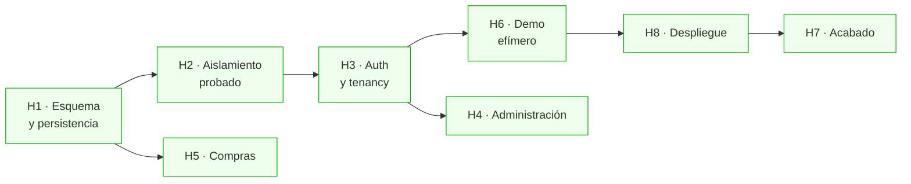

# Plan hasta el sistema terminado

Este documento dice, sin adornos, qué falta para que CoreBiz esté **desplegado, con datos reales
y con el aislamiento multi-tenant demostrado**, que es el único estado en el que el proyecto
cumple lo que promete.

El criterio de "terminado" es concreto y verificable:

> Un reclutador abre `corebiz.vercel.app/demo` desde el móvil, recibe su propio entorno con
> datos sembrados, opera el ciclo completo de venta, choca contra el límite del plan gratuito,
> y nada de lo que haga alcanza los datos de otro visitante. El repo, mientras tanto, tiene la
> matriz de aislamiento RLS en verde dentro de CI.

---

## Dónde está el proyecto hoy

Lo verificado, no lo aspiracional.

| Capa                          | Estado                                                                  |
| ----------------------------- | ----------------------------------------------------------------------- |
| Dominio (`packages/domain`)   | ✅ Ventas, inventario, RBAC, planes, dinero dual. 266 tests unitarios   |
| Casos de uso                  | ✅ 15, con puertos definidos y auditoría                                |
| Adaptadores en memoria        | ✅ Con rollback real. Sostienen `pnpm dev:nodb` y toda la suite         |
| API (`apps/api`)              | ✅ NestJS, 36 rutas, guards de RBAC, OpenAPI. Es la capa de entrega     |
| Interfaz (`apps/web`)         | ✅ 29 páginas, consumiendo la API desde el servidor, i18n ES/EN         |
| Tests E2E + BDD               | ✅ 25 escenarios Gherkin, 58 specs, independientes del orden            |
| Arquitectura verificada en CI | ✅ `dependency-cruiser` rompe el build si el dominio se acopla          |
| Persistencia real             | ✅ Adaptadores Prisma de cada puerto, UoW sobre transacción real        |
| Tablas de negocio             | ✅ 16 tablas, 14 con `tenant_id`; migraciones y semilla que cuadra sola |
| Aislamiento probado           | ✅ Matriz sobre toda tabla con `tenant_id`. 68 tests de integración     |
| Autenticación                 | ✅ Supabase Auth, sesión en cookies httpOnly, alta y recuperación       |
| Cabeceras de seguridad        | ✅ CSP con nonce por request, HSTS, COOP/CORP, Permissions-Policy       |
| Limitación de peticiones      | ✅ UPSERT atómico en Postgres, detrás del puerto `RateLimiter`          |
| Compras y proveedores         | ✅ `Supplier` y `GoodsReceipt` con su detalle, gated a PRO              |
| Administración                | ✅ Invitaciones con token hasheado, roles, auditoría y ajustes          |
| Demo efímero                  | ✅ Credenciales propias por visitante, TTL 24 h, purga y disyuntor      |
| Cobros, presupuestos, órdenes | 🚧 Anunciados en el menú, con su pantalla y su explicación              |
| Despliegue                    | 🚧 `render.yaml` y la guía completa; falta ejecutarla en cuentas reales |

**La lectura honesta:** el sistema corre sobre Postgres con las políticas RLS ejecutándose en CI,
tiene sesiones reales con su alta, su recuperación y su limitación de intentos, y los 25 escenarios
BDD pasan contra los dos adaptadores sin cambiar una línea.

Desde 2026-09-08 la capa de entrega es una API en NestJS y `apps/web` la consume por HTTP
([ADR 009](adr/009-api-dedicada-en-nestjs.md)). La migración **no cambió un solo test**, que era
su criterio de aceptación: 73 pruebas E2E en verde en memoria y 83 contra Postgres, con los
mismos ficheros de siempre.

Lo único que queda es ejecutar el despliegue, y es lo único que no se puede hacer desde el
repositorio: necesita cuentas de Supabase, Vercel y Render.

Dicho sin adornos: **el sistema está terminado como sistema y sin desplegar como producto.**

---

## El camino crítico

Las fases están ordenadas por **dependencia dura**, no por preferencia. Cada una desbloquea la
siguiente, y las tres primeras son innegociables antes de desplegar.

H4, H5 y H7 son paralelizables. **H1 → H2 → H3 → H6 → H8 es la línea recta hacia el link del CV**,
y ninguna se puede saltar.

---

## H1 · Esquema y persistencia real — ✅ HECHA

**Por qué bloqueaba todo:** no existía ni una sola tabla de negocio, y el composition root
lanzaba una excepción explícita para el driver `postgres` —fallar claro en vez de arrancar a
medias— así que no había nada que desplegar.

Fue la fase más grande y la de menor riesgo de diseño: los puertos ya existían y los adaptadores
en memoria eran la especificación ejecutable de lo que había que reproducir contra Postgres.

**Lo que costó más de lo previsto:** la semilla. `config.toml` apuntaba a un `seed.sql` que no
existía, y escribirlo obligó a decidir algo que el plan daba por hecho — que los datos de Postgres
fuesen **exactamente** los del driver en memoria. Sin esa igualdad, los escenarios Gherkin
necesitan una variante por adaptador y el criterio de abajo deja de poder cumplirse.

**Qué construir**

- [x] Esquema de los módulos de negocio (hoy introspeccionado a `packages/db/prisma/`): `customers`,
      `products`, `stock_movements`, `delivery_notes`, `delivery_note_lines`, `document_sequences`
      y `tenant_usage`. Los nombres ya están comprometidos en la lista de la migración de políticas.
- [x] Migraciones `create table` correspondientes. **Sin ellas, la migración de RLS salta las tablas
      en silencio** (`if to_regclass(...) is null then continue`) y el sistema queda sin políticas
      pareciendo que las tiene. Este es el fallo más peligroso del estado actual.
- [x] Convenciones ya decididas y que hay que respetar fila a fila: `bigint` en unidades mínimas para
      dinero, `uuid v7` como PK, índice compuesto con `tenant_id` **siempre primero**, tasa de cambio
      congelada en cada documento.
- [x] `packages/infrastructure/` con los adaptadores de Prisma de cada puerto. Un archivo por
      repositorio, espejo de los de memoria.
- [x] `UnitOfWork` real sobre una transacción de `postgres.js`, con `set_config(..., true)` para las
      GUCs de tenant. **Local a la transacción, nunca a la sesión** — con `false`, Supavisor reutiliza
      la conexión para otro tenant y la fuga es directa.
- [x] `DocumentSequences` con `select ... for update`: el correlativo de las notas de entrega no
      admite huecos ni duplicados bajo concurrencia.
- [x] Conectar el driver `postgres` en el composition root, sustituyendo el `throw`.
- [x] Cliente `postgres.js` con `prepare: false` y `max: 1` como singleton de módulo. Sin esto
      funciona en local y revienta en producción, que es la peor forma de descubrirlo.

Dos tablas que sí estaban en el plan y **no existen**: `product_stock` y `payments`. El saldo
vive en `products.on_hand`, derivado de los movimientos, así que una tabla aparte solo habría
añadido un sitio más donde el inventario puede descuadrar. Y `payments` no se creó porque el
módulo de cobros quedó fuera del alcance: el límite de crédito está implementado en el dominio
y hoy no llega a dispararse.

**Hecho cuando:** `DATA_DRIVER=postgres pnpm dev` levanta la aplicación contra Supabase local y los
25 escenarios BDD pasan **sin tocarse una línea**. Ese es el punto: si los tests no distinguen el
adaptador, la arquitectura hexagonal era real.

---

## H2 · El aislamiento, probado — ✅ HECHA

**Por qué bloqueaba el despliegue:** las políticas RLS estaban escritas y eran buenas, pero
nunca se habían ejecutado. Una política no probada es una hipótesis, y publicar un SaaS
multi-tenant sobre una hipótesis es exactamente lo que este proyecto dice saber evitar.

La matriz se comprobó por mutación, no solo por estar en verde: quitar `force row level security`
de una tabla y aflojar una política a `using (true)` ponen la suite en rojo. Un test de
aislamiento que nunca ha fallado no ha demostrado nada.

**Qué construir**

- [x] Matriz de aislamiento parametrizada: recorre la lista de tablas con `tenant_id` y, para cada
      una, autentica como tenant A e intenta `select` / `update` / `delete` sobre filas del tenant B,
      exigiendo cero filas afectadas. **Al añadirse una tabla nueva sin política, el test falla solo.**
- [x] Test de la fuga por GUC pegada: dos transacciones seguidas sobre la **misma conexión** con
      tenants distintos, comprobando que la segunda no ve nada de la primera. Es la prueba directa de
      por qué `set_config` va con `true`.
- [x] Test del `with check` en `update`: intentar mover una fila propia al tenant ajeno cambiándole
      el `tenant_id` debe fallar.
- [x] Test de `force row level security`, con un matiz que conviene decir: la comprobación es
      **estructural** (`relforcerowsecurity` en toda tabla con `tenant_id`) y no conductual. En
      Supabase el propietario de las tablas es `postgres`, que además tiene `BYPASSRLS`, así que
      desde su sesión no hay forma de observar el efecto de FORCE. A cambio hay un test que sí es
      conductual y cubre el riesgo real: dentro del Unit of Work, `current_user` es `authenticated`
      y ese rol no tiene ni `rolsuper` ni `rolbypassrls`.
- [x] Test de inmutabilidad del `audit_log`: `insert` y `select` permitidos, `update` y `delete`
      denegados.
- [x] Job `integration` en CI con `supabase start` sobre `ubuntu-latest`.

**Hecho:** el job `integration` levanta Supabase en CI, corre la matriz y después ejecuta los
mismos 25 escenarios BDD contra Postgres. `pnpm test:integration` ya no lleva _(pendiente)_
en la tabla del README. Esta es la fase que responde la pregunta de entrevista _"¿cómo sabes que tu
multi-tenant no filtra datos?"_ con un comando en vez de con una explicación.

---

## H3 · Autenticación y tenancy de verdad — ✅ HECHA

**Por qué bloqueaba:** `resolveContext()` leía el rol y el plan de dos cookies que cualquiera podía
editar desde las herramientas del navegador. Era deliberado y estaba comentado —permite a quien
visita la demo ver el RBAC actuando en vivo— pero no era autenticación.

**Cómo quedó resuelto sin perder la demo.** El orden de `resolveContext()` es: si hay sesión
verificada manda ella, y las cookies de demostración solo se obedecen dentro de un tenant marcado
`is_demo`. Sin sesión se cae al tenant público, y ahí está el detalle que importa: **se exige que la
fila tenga `is_demo = true`**, no basta con que el identificador coincida con la constante. Si
alguien apuntara `DEMO_TENANT_ID` a una empresa real por una variable mal puesta, la aplicación no
la sirve — redirige a la pantalla de acceso. Sin esa comprobación, un error de configuración sería
una empresa entera abierta al público.

**Qué construir**

- [x] Supabase Auth con `@supabase/ssr`, sesión en cookies `httpOnly` `Secure` `SameSite=Lax`.
- [x] Rutas `(auth)`: registro, acceso, recuperación, aceptar invitación.
- [x] Alta de tenant en el registro: crear tenant, membresía `owner` y ajustes por defecto, en una
      transacción.
- [x] `resolveContext()` pasa a validar la sesión y cargar la membresía desde la base de datos.
      **Las cookies de demo sobreviven solo dentro de un tenant marcado `is_demo`**, donde no hay nada
      que proteger y sí mucho que enseñar.
- [x] Middleware que resuelve el tenant activo y rechaza el acceso cruzado por URL.
- [x] Cabeceras de seguridad: CSP con nonce por request, HSTS, `Referrer-Policy`,
      `Permissions-Policy`, `X-Content-Type-Options`, `X-Frame-Options`.
- [x] Rate limiting con `security.rate_limit_hit()` en Postgres —un solo UPSERT atómico, $0, sin
      servicio externo— detrás del puerto `RateLimiter`.

**Hecho:** hay un test E2E que crea una cuenta nueva desde el formulario de registro y comprueba que
NO ve ni un cliente de la empresa de demostración. No es la matriz RLS otra vez desde otro ángulo:
la matriz prueba las políticas a nivel de SQL, y esto prueba el camino completo —sesión real,
cookies reales, políticas reales, navegador real— que es donde de verdad se rompen estas cosas.

El tenant activo sale de una cookie, pero solo si está entre las empresas del usuario, y esa lista
viene de `app.my_memberships()`, que resuelve la identidad con `auth.uid()` y **no acepta un
identificador de usuario como parámetro**. Editar la cookie a mano no lleva a ninguna parte.

---

## H4 · Módulo de administración — ✅ HECHA

Cierra el bucle de la multi-tenancy: sin esto un tenant no puede crecer más allá de su fundador.

- [x] Invitaciones **por enlace** con token de un solo uso y caducidad. No por correo: no hay
      SMTP configurado, así que el enlace se muestra UNA vez y quien invita lo hace llegar por
      donde quiera. Menos cómodo y más honesto que un correo que nunca sale.
- [x] Gestión de roles, respetando el trigger `enforce_last_owner` que ya impide quedarse sin dueño.
- [x] Visor del `audit_log` con filtros por actor, acción y fecha; exportación **gated a PRO**.
- [x] Ajustes del tenant: etiqueta y tasa del impuesto informativo, moneda base, tasa de cambio.
- [x] Panel de consumo del plan, con los mismos contadores que ya bloquean en el caso de uso.

**Hecho:** hay un escenario BDD que invita en bucle hasta que el servidor dice que no, y el mensaje
que aparece habla del **límite del plan** — algo que la pantalla no podría decir si el bloqueo
viviera en el botón. El formulario se deja enviable a propósito con las plazas agotadas.

**Tres decisiones que merecen leerse:**

- **El token de invitación no se guarda.** Se guarda su SHA-256, igual que una contraseña. Un token
  es una credencial: quien lo tenga entra con el rol que diga la fila. En claro, cualquier lectura
  de esa tabla —una copia de seguridad, un volcado de depuración— es una entrada a la empresa.
  El original existe dos veces: en el enlace que se entrega y en la URL que abre quien acepta.

- **La plaza se reserva al INVITAR, no al aceptar.** Cobrarla al aceptar dejaría que un propietario
  mandase diez invitaciones válidas y que la novena persona se encontrase rechazada dos días
  después, sin nada que pudiera hacer. El precio es que una invitación olvidada retiene una plaza,
  y se paga con `app.release_expired_invitations()`.

- **El correo del equipo sale de `app.tenant_members()`, no de un join a `auth.users`.** El rol
  `authenticated` no puede leer esa tabla, y el `GRANT SELECT` que sugiere el propio mensaje de
  error de Postgres daría a cualquier usuario del proyecto el correo y el hash de contraseña de
  todos los demás. Es la fuga que las políticas RLS evitan, abierta por la puerta de al lado.

---

## H5 · Compras y proveedores — ✅ HECHA (con un recorte declarado)

Cierra el ciclo **comprar → stock → vender**.

- [x] Agregados `Supplier` y `GoodsReceipt` en `packages/domain/src/purchasing/`.
- [ ] **`PurchaseOrder` NO se implementó.** Es el único punto del plan que queda sin cumplir, y
      conviene decirlo claro en vez de darlo por hecho. La orden de compra es el documento de "voy
      a pedir esto", con su propia máquina de estados y sus recepciones parciales contra ella. Para
      un comercio pequeño, lo que mueve el negocio es registrar lo que **llegó**; pedir antes es un
      flujo de empresas con departamento de compras. El ciclo comprar → stock → vender queda cerrado
      sin ella. Si entra después, `goods_receipts.purchase_order_id` ya está en el esquema esperándola.
- [x] La recepción de mercancía **suma stock generando movimientos**, igual que la emisión resta.
      Reutiliza el libro mayor que ya existe, sin tocar el saldo directamente. Hay un test de
      integración que comprueba la fila de `stock_movements`, no solo el saldo: un test que solo
      mirase `on_hand` pasaría igual con dos inventarios paralelos, que es el error a impedir.
- [x] Casos de uso, adaptadores, esquema, interfaz y escenarios BDD, siguiendo el patrón ya establecido.
- [x] Módulo completo **gated a PRO**, con el gate en el caso de uso. El módulo se ve bloqueado en
      el menú en lugar de desaparecer: saber que existe algo más es parte de un freemium honesto.

**Nota de alcance:** `Supplier` es un CRUD casi plano y está bien que lo sea. El músculo hexagonal se
demuestra en `GoodsReceipt`, donde hay invariante real. Aplicar la misma ceremonia a todo sería peor
ingeniería, y explicar por qué vale más que hacerlo.

Una decisión que merece leerse: `GoodsReceipt` **no toca el saldo de los productos**. Devuelve lo que
hay que sumar, y es el caso de uso quien llama a `Product.addStock()`. El inventario pertenece a
`Product` y solo él puede moverlo — si el documento escribiera saldos, habría dos sitios capaces de
descuadrarlo. Es el mismo reparto que en la emisión de notas.

El coste de compra se guarda por línea y **no se propaga al producto**. Recalcular el coste medio es
una decisión contable —FIFO, medio ponderado, último coste— que un comercio pequeño no ha tomado, y
tomarla por él en silencio le cambiaría los márgenes sin avisar.

---

## H6 · Demo efímero y control de coste — ✅ HECHA

Es la fase que convierte el proyecto en un link del CV en vez de un repo más.

- [x] Función SQL `clone_demo_tenant()`: `insert ... select` desde el tenant plantilla, remapeando
      las claves con `uuid_generate_v5(nuevo_tenant, id_viejo::text)`. Determinista, sin tabla de
      mapeo, sin orden de dependencias, una transacción.
- [x] Ruta `/demo`: entrega **credenciales propias** —correo y contraseña generados— y deja la
      sesión iniciada. Quien ya entró no vuelve a ver el botón: se le ofrece pasar a su copia.
- [x] Semilla compacta (~600–900 filas, ≈1,5 MB) que aparente un negocio con historia.
- [x] Purga con `pg_cron` cada 10 minutos, TTL de 24 h. Va dentro de Postgres porque el cron de
      Vercel Hobby es diario. Respaldos: purga perezosa dentro de la propia provisión, y el cron
      diario de Vercel como tercera red.
- [x] Circuit breaker sobre `pg_database_size()`: por encima del **70 %** de los 500 MB se deja de
      clonar y se entrega una cuenta de solo lectura sobre la plantilla compartida —una fila en vez
      de sesenta—; por encima del **85 %**, purga agresiva sin esperar al TTL.
- [x] Anti-abuso: 1 sandbox por IP y hora, tope global de 50 concurrentes (≈20 MB, 6 % del presupuesto).

**Por qué el modo degradado importa más que el límite:** un reclutador tiene que ver algo funcionando
siempre. Un error de cuota en el link del CV es el peor resultado posible del proyecto entero.

**Hecho:** hay un test E2E que abre dos visitantes en contextos distintos, escribe un cliente en
el sandbox de uno y comprueba que **no aparece** en el del otro. Y un test de integración que fuerza
el umbral del disyuntor con un presupuesto absurdamente pequeño y verifica que cae a modo degradado
en lugar de fallar.

**Tres decisiones que merecen leerse:**

- **Cada visitante recibe una cuenta de verdad, no una cookie.** Antes se entraba SIN sesión y una
  cookie firmada decía qué sandbox tocaba. Funcionaba y estaba defendida, pero obligaba a mantener
  viva una rama del composition root que decidía a qué empresa entra alguien **sin haber verificado
  quién es**. Ese código no falla de forma visible: falla sirviendo datos ajenos. Con credenciales
  propias esa rama desapareció, y de paso la demostración enseña el acceso funcionando, que es la
  mitad de lo que un ERP tiene que demostrar. La cuenta nace en la misma transacción que su
  sandbox, lleva la misma caducidad y se la lleva la misma purga.

- **La provisión va por POST, nunca por GET.** Es lo que más protege el presupuesto: un GET que
  provisiona lo dispara cualquier rastreador, cualquier previsualización de enlace de un chat y
  cualquier antivirus de correo. Publicar el enlace en una red social crearía decenas de copias de
  la base antes de que lo abriese una persona.

- **Los identificadores del clon se DERIVAN, no se generan.** `uuid_generate_v5(nuevo_tenant,
id_viejo)` da siempre la misma salida para la misma entrada, así que una clave foránea se remapea
  aplicando la fórmula al identificador al que apunta — sin consultar nada y sin importar el orden
  en que se copien las tablas. Con una tabla de correspondencias habría que copiar en orden de
  dependencias, mantener el mapa vivo toda la transacción y limpiarlo después.

**Un tercer detalle, que salió de un test que falló.** El límite de un sandbox por IP y hora hizo
imposible escribir el test de aislamiento entre visitantes, porque todos salen de la misma máquina.
El límite es correcto y se queda; lo que cambia es que ahora es configurable, y la suite lo sube.
Un límite que no se puede relajar para probarlo acaba probándose en producción.

---

## H7 · Acabado — ✅ HECHA

- [x] La nota de entrega **imprimible**, con el aviso _"Documento no fiscal / sin valor fiscal"_
      en el pie y espacio para las dos firmas. **No es un PDF de servidor**, y la razón está en
      [ADR 008](adr/008-imprimir-en-el-navegador.md): una librería que dibuja cajas maqueta peor y
      cuesta cientos de líneas, y un navegador sin cabeza no cabe en el límite de tamaño de una
      función del plan gratuito. El navegador de quien usa el sistema ya sabe hacerlo, mejor y
      gratis — y "Imprimir" es un botón que esa persona ya sabe usar.
- [x] Portada que explica qué es CoreBiz, lleva a cada módulo en un clic y ofrece crear cuenta
      solo a quien no ha entrado.
- [x] Observabilidad mínima: `/api/health` que **toca la base de datos de verdad** —un 200 que no
      consulta nada mantiene viva la función de Vercel y deja dormirse a Postgres, que es lo
      contrario de lo que hace falta— y registro estructurado de errores en JSON.
- [x] Tests de accesibilidad con `@axe-core/playwright` sobre siete rutas. Encontraron un fallo
      real: el rojo de los rellenos no llega a 4.5:1 como texto pequeño, así que los tonos de
      relleno y de texto están separados.
- [x] Diagrama de dependencias y ADRs 006, 007 y 008.

**Lo que salió de aquí y no estaba previsto.** Regenerar el diagrama destapó que el alias `@/` no
resolvía en `dependency-cruiser`: 22 importaciones aparecían como módulos fantasma, y el grafo de
`apps/web` estaba roto por la mitad. Las reglas por ruta seguían funcionando; las que recorren el
grafo —ciclos, huérfanos— no podían seguir esas aristas. Se descubrió por un aviso sobre un
componente que sí estaba importado: el aviso era la punta del problema, no el problema.

---

## H8 · Despliegue

El recorrido está escrito en [`DEPLOY.md`](DEPLOY.md). Lo que hay que recordar:

- [ ] Repositorio público en GitHub.
- [ ] Proyecto Supabase; migraciones por **conexión directa (5432)**, aplicación por **pooler (6543)**.
- [ ] Extensiones `pg_cron` y `uuid-ossp`.
- [ ] **TTL del access token a 10 minutos** en Supabase. No es cosmético: la API verifica la
      firma localmente contra el JWKS, así que revocar una cuenta tarda lo que le quede de
      vida al token. Requiere claves de firma asimétricas.
- [ ] Render: la API por blueprint (`render.yaml`), en la **misma región** que Supabase.
- [ ] Vercel: variables de entorno, con `CRON_SECRET` y `REQUEST_HASH_SECRET` marcadas como
      sensibles y comparadas en tiempo constante.
- [ ] `INTERNAL_API_SECRET` **idéntico** en Render y en Vercel. Es el único que comparten.
- [ ] `DATABASE_URL` **NO** en Vercel. Que la interfaz no tenga acceso a la base es la prueba
      observable de la separación; ponerla "por si acaso" la borra.
- [ ] Comprobar que `/docs` responde **404** en producción.
- [ ] Comprobar el arranque en frío: con la API dormida, `/demo` lleva a la pantalla de espera
      y **vuelve sola**. No a un error, y no a la portada.
- [ ] **Keepalive funcionando y comprobado.** Supabase pausa el proyecto tras 7 días sin tráfico y el
      link del CV muere solo. GitHub Actions cada 2 días, **más un monitor externo**
      (cron-job.org o UptimeRobot) porque GitHub desactiva los workflows programados tras 60 días sin
      commits. Esto es lo primero que hay que verificar después del despliegue, no lo último.

---

## Fuera de alcance, a propósito

Decidido, no olvidado:

- **Pasarela de pago.** El sistema de cuotas y gating se implementa completo porque es lo que se
  evalúa; el cobro real se activa desde administración. Vercel Hobby prohíbe el uso comercial, así
  que integrar Stripe rozaría esa cláusula sin añadir nada al portafolio.
- **Presupuestos (`quotes`).** Las tablas están en la lista de RLS y el flujo está diseñado, pero la
  nota de entrega ya demuestra la máquina de estados. Entra después de H6 si sobra tiempo.
- **Backups.** Supabase Free no los ofrece. El entorno demo es reconstruible desde la semilla del
  repo por diseño, así que la ausencia de backup es una consecuencia aceptada, no un descuido.

---

## Riesgos abiertos

| Riesgo                                                         | Mitigación                                                            |
| -------------------------------------------------------------- | --------------------------------------------------------------------- |
| Las políticas RLS fallan al ejecutarse por primera vez         | H2 va inmediatamente después de H1, antes de construir nada encima    |
| El pooler en modo transacción rompe algo que funciona en local | `prepare: false` desde el primer commit del adaptador, no como parche |
| Los 500 MB se llenan con sandboxes                             | Semilla compacta, tope de 50, TTL de 24 h y modo degradado            |
| El proyecto se pausa y el link del CV muere                    | Keepalive **con respaldo externo**; se verifica el día del despliegue |
| Los tests de integración alargan CI                            | Job en paralelo, caché de pnpm y de navegadores                       |

---

## Orden recomendado

**H1 → H2 → H3 → H6 → H8**, y después H4, H5 y H7 sobre un sistema ya vivo.

**Todas las fases están hechas menos H8.** El despliegue es lo único que queda, y es lo único
que no se puede hacer desde el repositorio: necesita una cuenta de Supabase y una de Vercel.
El recorrido está en [`DEPLOY.md`](DEPLOY.md).

La tentación es construir Compras primero porque es el módulo que más se parece a lo ya hecho y sale
rápido. Sería un error: añadiría superficie sobre un almacén en memoria y alejaría el despliegue.
**El proyecto vale más desplegado con tres módulos que completo en una carpeta local.**
