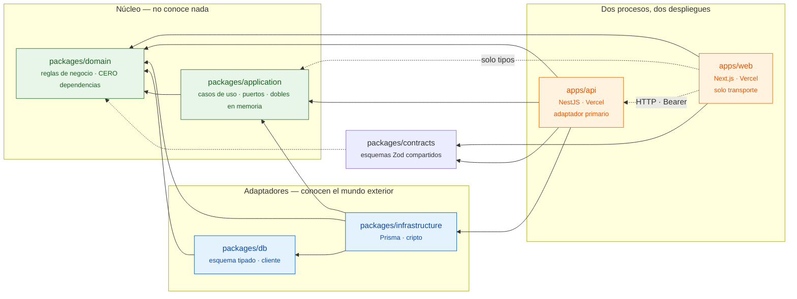

# Grafo de dependencias

Este diagrama está escrito a mano, y conviene decir por qué: el grafo que genera
`dependency-cruiser` módulo a módulo son casi mil nodos, incluidas las entrañas de
`node_modules`. Es exhaustivo y no comunica nada — nadie mira un diagrama de mil cajas
para entender una arquitectura.

**Lo que garantiza que este dibujo sea cierto no es el dibujo: es `pnpm arch`.** Las
flechas de abajo son las que la configuración de `.dependency-cruiser.cjs` permite, y
cualquier flecha que no esté aquí rompe el build. Si el diagrama se quedara obsoleto,
el CI lo diría antes que nadie.

Para el grafo exhaustivo, `pnpm arch:graph` lo regenera en
`dependency-graph.generated.md` (ignorado por git: es salida de herramienta, no fuente).

## Cómo se lee

Las flechas apuntan **siempre hacia adentro**. `packages/domain` no tiene ninguna
saliente — ni siquiera hacia `contracts` — y su `package.json` no declara una sola
dependencia. Es la propiedad que hace posible que la suite entera corra sin Docker: si el
dominio conociera la base de datos, no habría forma de sustituirla por un almacén en
memoria y levantar la aplicación completa contra él.

**Las dos flechas de puntos que salen de `apps/web` son las que cuentan la migración.**
La única forma que tiene la interfaz de llegar al núcleo es HTTP; lo que importa
directamente son `@corebiz/domain` —puro, y de ahí sale `Plan.of(code)` para que las
pantallas sigan preguntando por sus cuotas— y los TIPOS de `@corebiz/application`, que
son lo que mantiene su cliente HTTP comprobado contra el mismo puerto que cumple el
adaptador de Prisma. Valores de ese paquete, ninguno: eso lo vigila `pnpm lint`.

Que `apps/api` ocupe exactamente el sitio que ocupaba `apps/web` en este diagrama, sin
que nada del núcleo se moviera, es la demostración de que el hexágono no era decorativo.

## Las reglas que lo sostienen

| Regla                        | Qué impide                                                                              |
| ---------------------------- | --------------------------------------------------------------------------------------- |
| `domain-is-pure`             | Que el dominio importe cualquier cosa que no sea el dominio.                            |
| `application-no-infra`       | Que un caso de uso conozca Prisma, Supabase o el esquema.                               |
| `ui-no-direct-db`            | Que una pantalla hable con tablas en lugar de con casos de uso y modelos de lectura.    |
| `no-circular`                | Ciclos entre módulos. Encontró uno real entre los puertos de repositorios y de compras. |
| `web-no-infrastructure`      | Que la interfaz vuelva a hablar con Postgres. Es el criterio de aceptación de ADR 009.  |
| `api-modules-no-composition` | Que un controller se fabrique un contexto de tenant en lugar de recibirlo inyectado.    |

Las tres primeras son la arquitectura hexagonal expresada como algo que se ejecuta: no una
convención que se recuerda en la revisión, sino una regla que rompe el build.

`web-no-infrastructure` está escrita para atrapar **también el especificador sin resolver**,
y esa segunda alternativa en el patrón no es redundante. La primera defensa es pnpm con
`hoist=false`: al no declarar el paquete, el import ni siquiera resuelve y `tsc` rompe. Pero
con la regla escrita solo contra la ruta resuelta, no podía dispararse nunca en el estado
actual del repositorio — el mismo defecto que tenía la regla borrada de abajo. Existe para
el día en que alguien "arregle" ese error de compilación añadiendo la dependencia de vuelta.

Hay una que **no** está aquí y sí en `eslint.config.mjs`: que la interfaz importe TIPOS de
`@corebiz/application` pero no VALORES. El barril del paquete exporta las dos cosas por la
misma arista del grafo, así que dependency-cruiser no puede distinguirlas; eslint sí ve los
nombres importados. Ponerla aquí habría sido otra regla incapaz de fallar.

Hubo otra más, `service-role-quarantine`, que vigilaba las importaciones de la clave
capaz de saltarse RLS. Se borró al descubrir que apuntaba a un archivo **que no existe**:
llevaba meses en verde sin poder dispararse nunca. La arquitectura real resultó ser mejor
que la documentada —esa clave no se usa en ninguna parte— pero una regla que no puede
fallar es peor que ninguna, porque se lee como una garantía.
