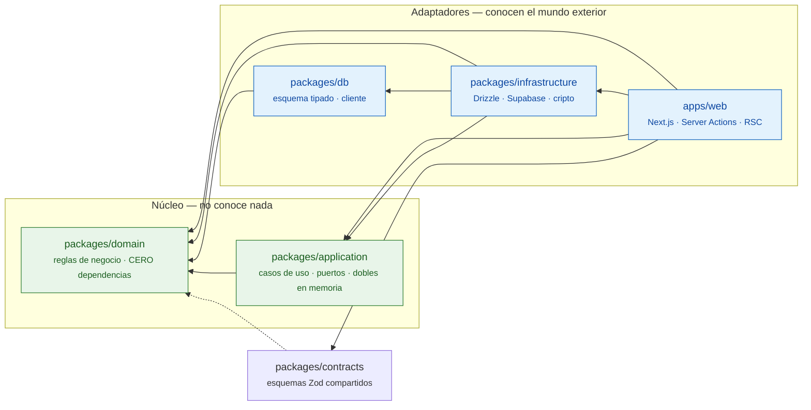

# Grafo de dependencias

Este diagrama está escrito a mano, y conviene decir por qué: el grafo que genera
`dependency-cruiser` módulo a módulo son casi mil nodos, incluidas las entrañas de
`node_modules`. Es exhaustivo y no comunica nada — nadie mira un diagrama de mil cajas
para entender una arquitectura.

**Lo que garantiza que este dibujo sea cierto no es el dibujo: es `pnpm arch`.** Las
flechas de abajo son las que la configuración de `.dependency-cruiser.cjs` permite, y
cualquier flecha que no esté aquí rompe el build. Si el diagrama se quedara obsoleto,
el CI lo diría antes que nadie.

Para el grafo exhaustivo, `pnpm arch:graph` lo regenera en
`dependency-graph.generated.md` (ignorado por git: es salida de herramienta, no fuente).

## Cómo se lee

Las flechas apuntan **siempre hacia adentro**. `packages/domain` no tiene ninguna
saliente — ni siquiera hacia `contracts` — y su `package.json` no declara una sola
dependencia. Es la propiedad que hace posible `pnpm dev:nodb`: si el dominio conociera
la base de datos, no habría forma de sustituirla por un almacén en memoria y arrancar la
aplicación completa sin Docker.

## Las reglas que lo sostienen

| Regla                     | Qué impide                                                                              |
| ------------------------- | --------------------------------------------------------------------------------------- |
| `domain-is-pure`          | Que el dominio importe cualquier cosa que no sea el dominio.                            |
| `application-no-infra`    | Que un caso de uso conozca Drizzle, Supabase o el esquema.                              |
| `ui-no-direct-db`         | Que una pantalla hable con tablas en lugar de con casos de uso y modelos de lectura.    |
| `service-role-quarantine` | Que la clave que **saltea RLS** se importe fuera de sus tres consumidores autorizados.  |
| `no-circular`             | Ciclos entre módulos. Encontró uno real entre los puertos de repositorios y de compras. |

Las tres primeras son la arquitectura hexagonal expresada como algo que se ejecuta. La
cuarta es seguridad: una importación descuidada de esa clave convierte todo el
aislamiento multi-tenant en decorativo.
